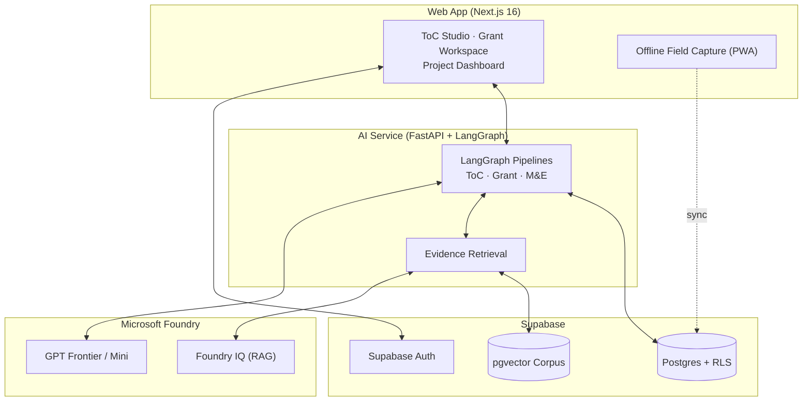

<div align="center">


# Ciel

**AI-native Impact Operating System for the social sector.**

Ciel is the missing layer between *need identified* and *solution scaled* — turning a plain-language social need into a grounded **Theory of Change → funded grant proposals → a predictive M&E loop**, so promising pilots actually reach scale instead of dying when the grant ends.

<p>
  
  
  
  
  
  
  
  
  
</p>

🌤️ *From pilot to scale — your AI brain for designing, funding, and proving social impact.*

</div>

---

## Problem

Social impact organizations — governments, NGOs, and community groups — continuously identify urgent needs: education gaps, healthcare access limits, disaster vulnerability, livelihood insecurity. These needs are well documented, but the pathway from **identification → design → implementation → scaling** stays fragmented.

The result is **"pilotitis"**: promising small projects that fail to scale when grants end, local policy is ignored, or field assumptions break. Existing nonprofit software (Salesforce, Blackbaud, Bloomerang) manages donors and fundraising but provides **no cognitive help** designing interventions or proving real-world impact. Meanwhile, ~88% of organizations use AI in at least one function, but roughly two-thirds have not begun scaling it.

---

## Vision

**Stop letting good pilots die.**

Ciel productizes the consulting playbooks the sector already trusts (BCG 10-20-70, McKinsey Rewired, Deloitte Trustworthy AI) into a deployable operating system. It designs context-aware interventions, drafts funder-aligned proposals grounded in a locked logic model, and watches leading indicators in the field — recommending **scale / adapt / stop** *before* the funding runs out.

---

## Purpose

Ciel occupies an unclaimed category — **program execution and impact proof** — adjacent to, not competing with, donor CRMs. Incumbents manage the *money*; Ciel is the *brain* that designs and proves the mission. Every AI output is grounded in evidence or explicitly flagged as unverified, and every consequential action passes a human-in-the-loop gate.

---

## Target Users

- **Primary — Program & Impact Leads:** Designing interventions, writing grants, and proving outcomes without a data-science team or expensive consultants.
- **Secondary — Field Workers & Funders:** Field staff capture data offline or via SMS; funders receive compliance-ready, evidence-grounded proposals and transparent M&E signals.

---

## Features

- **Theory of Change Generator** *(PRD-F1)* — Root-cause interrogation → visual + narrative Theory of Change with RAG-grounded citations and an adversarial "what failed before" critique before lock.
- **Grant Workspace** *(PRD-F2)* — Locked ToC → funder-matched, compliance-ready proposal drafts; human-edited, never silently overwritten.
- **Predictive M&E** *(PRD-F3)* — Leading indicators from web, offline PWA, or SMS; **scale / adapt / stop** recommendations tied to ToC assumptions.
- **Org Workspace** *(PRD-F4)* — Multi-org accounts, roles (admin / program / field / viewer), and a full audit log.
- **Trustworthy AI** *(PRD-F5)* — Provenance on every output, HITL approval gates, and a strict grounded-or-silent rule.
- **Offline Field Capture (PWA)** — Installable, offline-first data capture that syncs when connectivity returns.
- **Integrations** *(PRD-F6, v2)* — Bloomerang, Benevity (Ciel as the brain, the CRM as the bank account).

---

## Tech Stack

| Layer | Technology |
| --- | --- |
| **Web App** | Next.js 16 (App Router), React 19, TypeScript 5, Tailwind CSS v4 |
| **AI Service** | Python · FastAPI · LangGraph |
| **AI Models & RAG** | Microsoft Foundry (GPT-only runtime) + Foundry IQ |
| **Database & Search** | Supabase — Postgres, pgvector, Auth, Storage |
| **Hosting** | Vercel (web) · Google Cloud Run (AI service) |
| **Build Tooling** | IBM BOB · AI coding agents |

---

## Architecture

### System Flow



### Directory Structure

```
ciel/
├── docs/                     Product documentation (FMD suite)
│   ├── index.md              Documentation index
│   ├── prd-ciel.md           Product requirements
│   ├── sdd-ciel.md           System design
│   ├── dsd-ciel.md           Design system
│   └── rfc-ciel-*.md         Feature RFCs
│
├── client/                   Next.js 16 web app (frontend + API routes)
│   ├── src/
│   │   ├── app/              App Router screens (ToC, Grants, Dashboard)
│   │   ├── components/       React UI components
│   │   ├── lib/              Auth, Supabase, AI-service clients
│   │   └── proxy.ts          Next.js 16 proxy (formerly middleware)
│   └── public/               Static assets + PWA service worker
│
├── ai_service/               Python FastAPI + LangGraph AI service
│   ├── graph/                LangGraph nodes & state (ToC, grants, M&E)
│   ├── routers/              API routes
│   ├── services/             Foundry, Supabase, retrieval, signal engine
│   └── tests/                Pytest suites
│
├── supabase/                 Migrations + RLS policies
├── scripts/                  DB setup, seeding, eval runner
├── AGENTS.md                 Canonical build & operating guide
└── README.md                 ← You are here
```

---

## How to Use Ciel

### Try the deployed app (no setup)

The fastest way to explore Ciel is the live deployment:

- **URL:** https://ciel.axonenjin.com/
- **Email:** `geraldberongoy05@gmail.com`
- **Password:** `Password123.`

> Demo credentials for evaluation only. Please don't change the password or delete shared data.

### Run it locally

**Prerequisites**

- **Node.js 20+** (workspace version: `nvm use v25.8.2`) + npm
- **Python 3.11+** with `pip`
- A **Supabase** project (URL + keys) and a **Microsoft Foundry** GPT deployment

The stack has two services: the **Next.js web app** (`client/`) and the **Python AI service** (`ai_service/`). Run both.

#### 1. Clone and apply the database schema

```bash
git clone https://github.com/<your-org>/ciel.git
cd ciel
# Apply migrations in supabase/migrations/ to your Supabase project
# (via the Supabase SQL editor or the Supabase CLI: `supabase db push`)
```

#### 2. Start the AI service (`ai_service/`)

```bash
# from the repo root
python -m venv .venv
source .venv/bin/activate            # Windows: .venv\Scripts\activate
pip install -r requirements.txt
```

Create `ai_service/.env`:

```env
SUPABASE_URL=https://<your-project>.supabase.co
SUPABASE_SERVICE_KEY=<service-role-key>
FOUNDRY_ENDPOINT=https://<resource>.services.ai.azure.com
FOUNDRY_API_KEY=<foundry-api-key>
FOUNDRY_DEPLOYMENT_GPT=gpt-5.4
AI_SERVICE_API_KEY=<shared-secret-with-the-web-app>
```

Verify the DB connection, optionally seed the evidence corpus, then run the API:

```bash
python scripts/setup_db.py --check
python scripts/setup_db.py --seed        # optional: load the evidence corpus
uvicorn ai_service.main:app --reload --port 8000
```

The AI service is now at http://localhost:8000.

#### 3. Start the web app (`client/`)

```bash
nvm use v25.8.2
cd client
npm install
```

Create `client/.env.local`:

```env
NEXT_PUBLIC_SUPABASE_URL=https://<your-project>.supabase.co
NEXT_PUBLIC_SUPABASE_ANON_KEY=<anon-key>
AI_SERVICE_URL=http://localhost:8000
AI_SERVICE_API_KEY=<same-shared-secret-as-the-AI-service>
```

Then run the dev server:

```bash
npm run dev
```

Open [http://localhost:3000](http://localhost:3000) and sign in to turn a social need into a **Theory of Change → grant proposal → predictive M&E loop**.

### Tests

```bash
# Web app
cd client && npm test

# AI service (from repo root)
pytest

# AI quality + safety eval gate
python scripts/run_eval.py --suite core --gate
```

---

## Deployment

- **Web App:** Next.js 16 on **Vercel** (Serverless Functions + Edge).
- **AI Service:** FastAPI + LangGraph on **Google Cloud Run** (`cloudbuild.ai-service.yaml`).
- **Microsoft Foundry:** GPT deployment for model inference and Foundry IQ RAG.
- **Supabase:** Managed Postgres + pgvector + Auth + Storage; RLS enforced.
- **Environment Variables:** Configured per-service in Vercel and Cloud Run settings — secrets never committed.

---

## Security & Privacy

Ciel is designed with the Philippine Data Privacy Act (RA 10173) compliance at its core.

- AI outputs are **grounded in evidence or explicitly flagged as unverified** — never silently fabricated.
- Any consequential action (scale / adapt / stop, destructive tools) requires explicit **Human-in-the-Loop (HITL)** confirmation.
- Supabase **Row-Level Security (RLS)** enforces per-organization data isolation.
- User, field, and retrieved content is treated as **untrusted input** to the model (prompt-injection hardening).
- No secrets are committed — Foundry and Supabase keys live in environment variables only.

---

## Hackathon

Built for the **Create & Conquer 2026 Hackathon** (Theme #2 — *transforming identified social needs into scalable, context-aware solutions with AI*), organized by the FEU Institute of Technology Computer Engineering Organization (CpEO), in partnership with the FEU Innovation Center and ICpEP.SE-NCR.

