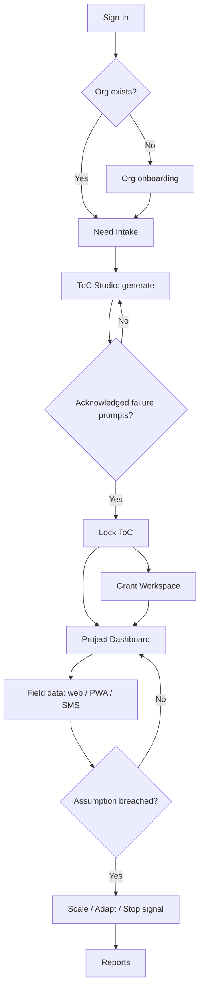

# Product Requirements Document (PRD)

**Project:** Ciel — AI-native Impact Operating System for the social sector
**Date:** 2026-06-25
**Version:** 1.0
**Owner:** Ciel Team — Create & Conquer 2026
**Status:** Locked
**Last reconciled:** 2026-06-25
**BRD:** [brd-ciel.md](brd-ciel.md) · **Evidence:** [evidence-ciel.md](evidence-ciel.md) · **Design:** [dsd-ciel.md](dsd-ciel.md)

---

## 1. Product Purpose & Value Proposition

Ciel is an **Impact Operating System**: it walks a resource-constrained organization from a plain-language social need to a scaled, sustainably funded, evidence-proven intervention. A user types *"high youth unemployment in our municipality,"* and Ciel (1) interrogates the root causes and produces a rigorous **Theory of Change**, (2) converts that logic model into **donor-matched, compliance-ready grant proposals**, and (3) stands up a **predictive monitoring loop** that ingests field data over SMS/offline and signals whether to scale, adapt, or stop. Incumbent nonprofit software manages money and contacts; Ciel is the *cognitive layer* that designs and proves the mission — the part the market has never had ([evidence B3](evidence-ciel.md)).

---

## 2. Target Personas

**Primary Persona — Maria, NGO Program Manager**
- *Who they are:* Maria, 38, runs livelihood programs at a 25-person NGO in Cebu. Mission-driven, perpetually under-resourced, fluent in Excel and Facebook, not in CRMs.
- *Their core frustration:* She spends evenings hand-building logframes, chasing grant deadlines, and reconciling M&E spreadsheets that arrive too late to change anything. Her last Salesforce attempt became "an unorganized bucket of information" ([evidence B2](evidence-ciel.md)).
- *What success looks like:* Design a defensible program in an afternoon, win the grant, and *see* whether it's working in time to fix it.

**Secondary Persona — Engr. Dan, LGU Planning & Development Officer**
- *Who they are:* Dan, 45, a planning officer at a 4th-class municipality. Accountable for public funds and audit trails.
- *Their core frustration:* He must justify every peso with evidence and procurement compliance, using legacy, paper-bound workflows. He buys *risk mitigation and compliance*, not "disruptive AI" ([evidence E1, E4](evidence-ciel.md)).

**Tertiary (buyer) — Foundation / CSR Portfolio Manager:** wants standardized, comparable impact reporting across many grantees.

---

## 3. Core Features & Priorities

Stable IDs — never renumbered. Downstream SDD/RFC/QAD/SAD/CLR trace to these.

| ID | Feature | Description | Priority |
|----|---------|-------------|----------|
| PRD-F1 | **AI Theory-of-Change Generator** | From a plain-language need, interrogate root cause vs symptom, target population, and ecosystem overlap; generate a visual + narrative ToC with evidence-backed activities, inputs, and measurable outcomes; surface *historical failures* in similar contexts ("intelligent failure"). RAG-grounded. → [rfc-ciel-toc-generator.md](rfc-ciel-toc-generator.md) | Must-Have |
| PRD-F2 | **Automated Grant Writing & Resource Alignment** | Translate the locked ToC into compliance-ready proposals matched to donor/agency KPIs (foundations, CSR, government). Human-edited, citation-grounded. | Must-Have |
| PRD-F3 | **Predictive M&E + Field Ingestion** | Ingest leading indicators from the field via offline-first PWA and SMS/USSD; track against ToC assumptions; fire **scale / adapt / stop** signals and anticipatory risk alerts. → [rfc-ciel-field-mande.md](rfc-ciel-field-mande.md) | Must-Have (vision) / Should-Have (hackathon slice) |
| PRD-F4 | **Org Workspace & Identity** | Multi-org accounts, roles (admin/program/field/viewer), project workspaces, audit log. The container the three modules live in. | Must-Have |
| PRD-F5 | **Trustworthy-AI Governance & "Return on Mission" Reporting** | Provenance on every AI output, bias/groundedness guardrails, human-in-the-loop approvals, and stakeholder-tailored impact reports quantifying Return on Mission. | Should-Have |
| PRD-F6 | **Ecosystem Integrations** | APIs to Bloomerang/DonorPerfect (donor CRM) and Benevity (CSR matching) — Ciel as the "brain," incumbents as the "bank account" ([evidence B3](evidence-ciel.md)). | Won't-Have (v1) → v2 |

---

## 4. User Stories & Acceptance Criteria

**US-01 — Generate a Theory of Change (PRD-F1)**
> As Maria, I want to turn a described need into a rigorous Theory of Change so that I design from root causes instead of assumptions.

Acceptance Criteria:
- Given a plain-language need, when Maria submits it, then Ciel returns a structured ToC (problem → inputs → activities → outputs → outcomes → impact) within the latency target, **with at least one cited evidence source per outcome**.
- Given a draft ToC, when Maria reviews it, then Ciel presents ≥1 "what has failed before in similar contexts" prompt she must acknowledge before locking.
- Given any AI claim, when it is shown, then it is traceable to a retrieved source or explicitly labeled "unverified — needs human input" (no ungrounded assertions).

**US-02 — Draft a matched grant proposal (PRD-F2)**
> As Maria, I want to generate a funder-matched proposal from my ToC so that I spend my time on the mission, not paperwork.

Acceptance Criteria:
- Given a locked ToC and a selected funder profile, when Maria requests a draft, then Ciel produces a structured proposal aligned to that funder's KPIs, with each claim citing the ToC or evidence.
- Given a generated draft, when Maria edits it, then her edits persist and the AI never silently overwrites human text.

**US-03 — See whether a program is working (PRD-F3)**
> As Maria, I want live indicators against my ToC assumptions so that I can adapt before the funding runs out.

Acceptance Criteria:
- Given a project with a ToC, when field data arrives (web, offline-sync, or SMS), then the dashboard updates leading indicators and flags any assumption breaching its threshold.
- Given an underperforming cohort, when a threshold is breached, then Ciel fires a **scale / adapt / stop** recommendation tied to the specific ToC assumption that failed.

**US-04 — Submit data from the field with no signal (PRD-F3)**
> As a field volunteer, I want to record data offline or by SMS so that low connectivity doesn't break reporting.

Acceptance Criteria:
- Given no connectivity, when a volunteer records an entry in the PWA, then it is queued locally and syncs without data loss when connectivity returns.
- Given a feature phone, when a volunteer texts a structured SMS code, then the entry is parsed and attributed to the correct project, or a clarifying reply is sent.

**US-05 — Defend public spending (PRD-F4/F5)**
> As Engr. Dan, I want an audit-ready trail and compliant reporting so that I can justify public funds.

Acceptance Criteria:
- Given any consequential action, when it occurs, then it is written to an immutable audit log (actor, time, change).
- Given a reporting period, when Dan exports a report, then it includes provenance and maps to the relevant compliance checkpoints.

---

## 5. App Flow & UX Intent

**Design reference:** [dsd-ciel.md](dsd-ciel.md)

### 5.1 Screen Inventory

| Screen | Purpose | Entry points | States to design |
|--------|---------|--------------|------------------|
| Landing / Sign-in | Auth + value framing | cold visit, invite link | empty / loading / error / success |
| Org onboarding | Create/join org, pick sector | first login | loading / error / success |
| Need Intake | Capture the plain-language need + context | dashboard CTA | empty / loading / error / success |
| ToC Studio | Generate, review, challenge, lock the ToC | from intake | empty / generating / error / locked |
| Grant Workspace | Select funder, generate + edit proposal | from locked ToC | empty / generating / editing / error |
| Project Dashboard | Live indicators, signals, assumptions | from locked ToC | empty / loading / alert / healthy / error |
| Field Capture (PWA) | Record entries, offline-capable | mobile, deep link | offline-queued / syncing / error / success |
| Reports | Return-on-Mission + compliance export | dashboard | empty / generating / success |
| Admin / Audit | Roles, members, audit log | settings | loading / success |

*Every interactive screen defines empty / loading / error / success (the AI screens add a distinct "generating" state).*

### 5.2 App Flow

**Linear (primary path):**

`Sign-in → Org onboarding → Need Intake → ToC Studio (generate → challenge → lock) → Grant Workspace → Project Dashboard → (field data) → Signals/Reports`

**Branching (Mermaid):**

**Flow annotations:**

| Flow concern | Detail |
|--------------|--------|
| Entry points | cold sign-in, org invite link, field-capture deep link, inbound SMS |
| Decision branches | org exists?; failure prompts acknowledged?; assumption breached? |
| Dead ends | none — every screen has a forward or back path; locked ToC is editable only via a new version |
| Abandonment / exit | intake/ToC drafts auto-save; field entries queue offline and resume on reconnect |
| Edge cases | offline, SMS parse failure (clarifying reply), AI unavailable (fallback below), permission denied, duplicate submit, session expiry |

### 5.3 Onboarding Flow
- **Aha / first-value moment:** the user sees their first generated Theory of Change with cited evidence — value before any payment.
- **Time-to-first-value target:** < 15 minutes from sign-in to a draft ToC (supports [BRD-M1](brd-ciel.md)).
- **Skippable / resumable:** Yes — onboarding is resumable; drafts persist.
- **Friction budget:** email + org name to start; no credit card for the ToC tier.

### 5.4 UX Constraints
- **Low-connectivity first:** core field flows must work offline and degrade to SMS; never assume broadband ([evidence A3](evidence-ciel.md), RFC-002).
- **Human agency always visible:** AI proposes, humans dispose — every AI output is editable and labeled with provenance.
- **Accessible, mobile-friendly, bilingual-ready** (English/Filipino copy slots); primary mobile breakpoint 375px.

### 5.5 Instrumentation & Event Taxonomy

| Event name | Fires when | Key properties | Feeds metric |
|------------|-----------|----------------|--------------|
| `toc_generated` | a ToC draft is first returned | org_id, need_id, latency_ms, sources_count | BRD-M1 |
| `toc_locked` | user locks a ToC after challenge | org_id, toc_id, failure_prompts_ack | BRD-M3 |
| `grant_drafted` | a proposal draft is generated | org_id, toc_id, funder_id, draft_time_ms | BRD-M2 |
| `data_source_connected` | org connects web/PWA/SMS source | org_id, source_type | BRD-M3 |
| `mande_signal_fired` | scale/adapt/stop recommendation issued | project_id, signal_type, assumption_id | BRD-M4 |
| `funding_recorded` | grant value attached to a project | project_id, amount_php, funder_id | BRD-M5 |
| `project_scaled` | project expands cohort/geography after a signal | project_id, prev_scope, new_scope | BRD-M6 |

**Naming convention:** snake_case `object_action`, past tense; **no PII in property values**.
**Analytics tool:** PostHog (self-hostable; PH-data-residency friendly) — confirm in SDD.

---

## 6. Out of Scope for This Release
- PRD-F6 ecosystem integrations (Bloomerang/Benevity) — deferred to v2.
- Native mobile apps — PWA only in v1.
- Multi-language model fine-tuning — v1 uses prompt-level localization.
- Automated fund disbursement / payments — never in scope (see BRD §4).

---

## 7. AI / Agent Feature Specifications

**AI Component:** Ciel Reasoning Engine (powers PRD-F1, F2, and F3 signal generation).
**Model(s) considered:** GPT (frontier/mini) via **Microsoft Foundry**; Claude (Opus/Sonnet) — *not available in our Foundry tenant*; open-weight fallback (Llama via local runner) for cost-sensitive ops.
**Selected model:** **GPT (frontier for interactive generation and the adversarial "intelligent failure" critique; GPT-mini for cheap classify/parse)** via Microsoft Foundry — *reason:* the team's Foundry tenant exposes only GPT deployments; GPT gives strong grounded reasoning + tool-use on the available control plane. The BCG/Anthropic social-impact pattern ([evidence C2](evidence-ciel.md)) validates the sector, not the runtime model. See [cr-ciel-002.md](cr-ciel-002.md).

**What the AI does:** converts a need into a grounded ToC; critiques it against historical failures; drafts funder-matched proposals; interprets field indicators against ToC assumptions to recommend scale/adapt/stop.

**Input → Output contract:**
- Input: structured need + org/context profile + retrieved evidence (Foundry IQ RAG over a development-evidence corpus).
- Output: structured JSON (ToC graph, proposal sections, signal objects) rendered to UI; every claim carries a source ref or an "unverified" flag.
- Latency expectation: first ToC draft < 30 s (streamed); proposal draft < 60 s; signals computed on data ingest (near-real-time).

**Human-in-the-loop points:**
- User must acknowledge "intelligent failure" prompts before a ToC can lock.
- No proposal is "final" without human review; AI never overwrites human edits.
- Scale/adapt/stop signals are *recommendations*, never automated actions.

**Fallback behavior when AI fails/unavailable:** degrade to template-based ToC/proposal scaffolds + cached evidence; queue generation for retry; dashboards continue showing raw indicators without AI interpretation. Never block field data capture on AI availability.

**Token / cost budget per operation:** target ≤ ~8–12k tokens per ToC generation and ≤ ~6k per proposal section at Sonnet pricing; adversarial critique (Opus) budgeted separately and rate-limited. Exact figures pinned in SDD/BUILD.

---

## 8. Dependencies & Assumptions

**Dependencies:**
- Microsoft Foundry tenant (Agent Service + Foundry IQ) with GPT access.
- Postgres + pgvector (Supabase or managed) for app data + evidence embeddings.
- An SMS/USSD gateway with PH coverage (e.g., a Globe/Smart-compatible provider) for field ingestion.
- A curated development-evidence corpus (academic + sector sources) to ground RAG.

**Assumptions:**
- Beachhead users operate in mixed/low connectivity; some field actors use feature phones.
- Orgs will share program data if privacy and provenance are demonstrably handled (RA 10173).
- Pilot funders/foundations value standardized, comparable impact reporting.

---

## 9. Implementation Plan

| # | Phase / Milestone | Entry criteria | Exit criteria (DoD) | Deliverable | Depends on | Owner (DRI) | Top risk |
|---|-------------------|----------------|---------------------|-------------|------------|-------------|----------|
| M1 | Requirements locked | BRD/PRD drafted | scope signed off; out-of-scope explicit | Approved PRD | — | Product | scope creep (R6) |
| M2 | Design (UX + system) | PRD locked | DSD + SDD approved; brand boards done | Design system + architecture | M1 | Design/Tech | low-connectivity design gaps |
| M3 | Development (vertical slice) | Design signed off | PRD-F1 + thin F3 demo path pass locally | Feature-sliced build on `client/` | M2 | Eng | AI grounding quality |
| M4 | Testing & QA | build feature-complete | QAD release criteria; 0 P0/P1; AI eval gate passed | QA sign-off | M3 | QA | hallucination/bias |
| M5 | Demo deployment | QA signed off | deployed prototype; smoke tests green | Hosted demo + teaser | M4 | Eng | demo-day env failure |
| M6 | Post-hackathon / pilot | submitted | pilot org onboarded; metrics reviewed at 30d | Pilot + monitoring | M5 | Product | adoption |

**Rollout strategy:** feature-flag + phased — *reason:* ship the ToC slice first, gate Modules 2–3 behind flags so the demo always has a working core.
**Rollback plan:**
- *Trigger criteria:* AI eval regression (groundedness below threshold), any P0, or error rate > 2% in first 24h.
- *Revert mechanism:* redeploy previous tagged release; DB migrations are backward-compatible; feature flags disable a module without redeploy.

**RFC cross-reference:** PRD-F1 → [rfc-ciel-toc-generator.md](rfc-ciel-toc-generator.md); PRD-F3 → [rfc-ciel-field-mande.md](rfc-ciel-field-mande.md).

---

## Self-Check

- [x] Every Must-Have feature has ≥1 user story (F1→US-01, F2→US-02, F3→US-03/04, F4/F5→US-05)
- [x] Acceptance criteria are testable (Given/When/Then)
- [x] §5.1 every interactive screen defines empty/loading/error/success (+ generating for AI)
- [x] §5.2 flow has no unintended dead ends; entry/exit/edge cases annotated
- [x] §5.5 every BRD-M# has a feeding event
- [x] §6 names things explicitly cut
- [x] §7 filled (AI is core)
- [x] §9 covers through post-launch with explicit rollback trigger + mechanism and a DRI per milestone
- [x] This document answers *what*, not *how* (architecture → [sdd-ciel.md](sdd-ciel.md))
