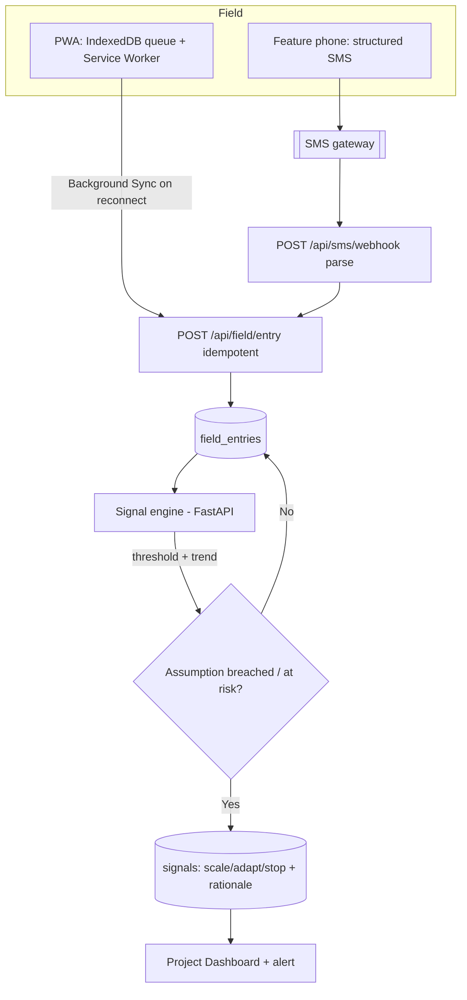

# Request for Comments (RFC) / Tech Spec

**Title:** Predictive M&E with Low-Connectivity Field Ingestion (Offline PWA + SMS)
**Date:** 2026-06-25
**Author:** Ciel Team — Create & Conquer 2026
**Status:** `Approved`
**Last reconciled:** 2026-06-25
**PRD Reference:** [prd-ciel.md](prd-ciel.md) §3 PRD-F3, US-03/US-04
**SDD Reference:** [sdd-ciel.md](sdd-ciel.md) §3 (`field_entries`, `signals`), §7 NFRs
**RFC ID:** `ciel-rfc-002`

---

## 1. Context & Objective

**The problem this solves:** Interventions deploy where broadband and electricity are unreliable, yet M&E today is manual and retroactive — reports arrive too late to change outcomes ([Idea.MD.md](../Idea.MD.md); [evidence A3](evidence-ciel.md)). PRD-F3 must (a) capture field data in low/no connectivity without loss, and (b) turn leading indicators into **scale / adapt / stop** recommendations against the ToC assumptions locked in RFC-001.

**Reference:** implements PRD-F3 (US-03, US-04); consumes `toc_assumptions`; writes `field_entries` + `signals`.

**Success criteria:**
- **Zero data loss** for entries recorded offline; they sync exactly once on reconnect ([SDD §7](sdd-ciel.md)).
- A feature-phone user can submit a valid entry by **SMS** and get an acknowledgment < 30s.
- When an assumption's indicator breaches its threshold, a **signal** fires within one ingestion cycle, naming the specific assumption and a grounded rationale ([BRD-M4](brd-ciel.md)).

---

## 2. Proposed Solution

Three parts: an **offline-first PWA** for smartphones, an **SMS/USSD bridge** for feature phones, and a **signal engine** that evaluates indicators against ToC assumptions.



**Architecture changes:**
- PWA service worker + IndexedDB outbox; Background Sync flushes the outbox; each entry carries a `client_uuid` for idempotency.
- `POST /api/sms/webhook` parses structured SMS codes (e.g., `CIEL <project_code> <indicator>=<value>`), maps to a project, replies to confirm or clarify.
- Signal engine: deterministic **threshold + lightweight trend forecast** (EWMA/linear) computes risk; an LLM call produces only the **human-readable rationale**, never the decision.

---

## 3. Technical Details & Contracts

### Data Model Changes

```sql
-- field_entries and signals already defined in SDD §3 (field_entries.client_uuid UNIQUE = idempotency key).
-- New: rollup for fast dashboards + forecasting input.
CREATE TABLE indicator_points (
  id          UUID PRIMARY KEY DEFAULT gen_random_uuid(),
  project_id  UUID NOT NULL REFERENCES projects(id) ON DELETE CASCADE,
  assumption_id UUID REFERENCES toc_assumptions(id) ON DELETE SET NULL,
  indicator   TEXT NOT NULL,
  value       NUMERIC NOT NULL,
  observed_at TIMESTAMPTZ NOT NULL,
  CONSTRAINT uq_point UNIQUE (project_id, indicator, observed_at)
);
CREATE INDEX idx_points_series ON indicator_points (project_id, indicator, observed_at);
```

### API Changes

```
POST /api/field/entry            (idempotent — safe to retry from offline queue)
Request:
{ "client_uuid":"uuid", "project_id":"uuid", "source":"pwa",
  "values":[{"indicator":"attendance","value":18,"observed_at":"2026-06-25T08:00:00Z"}] }
Response: 201 {"entry_id":"uuid","deduped":false}   |   200 {"deduped":true}  // replay

POST /api/sms/webhook            (gateway → Ciel)
Inbound: { "from":"+639...", "text":"CIEL JUAN01 attendance=18" }
Effect:  parse → field_entry → reply "Ciel: recorded attendance=18 for JUAN01. Salamat!"
         on parse fail → reply with the expected format (no silent drop)

GET /api/projects/:id/signals
Response: [{ "signal_type":"adapt","assumption_id":"uuid",
             "rationale":"Attendance trending below the 12/session assumption for 3 weeks ...",
             "created_at":"..." }]
```

### State Management
PWA holds an outbox in IndexedDB; the service worker listens for `sync` events (Background Sync API) and POSTs each queued entry; on `201`/`200 deduped` it clears the item. The UI shows per-entry status: `queued (offline)` → `syncing` → `synced`. Server idempotency is enforced by the `client_uuid` UNIQUE constraint, so retries are safe even if the SW double-fires.

---

## 4. Alternatives Considered

| Option | Why Rejected |
|--------|-------------|
| **Online-only forms** (no offline) | Fails the core constraint — field deployments lack reliable connectivity ([A3](evidence-ciel.md)); would reproduce the very pilotitis driver Ciel attacks. |
| **Polling sync** instead of Background Sync API | Drains battery/data on cheap phones and delays sync; Background Sync flushes opportunistically when connectivity returns. (Fallback: manual "sync now" button for browsers without Background Sync.) |
| **Free-text SMS + NLU parsing** | Brittle and costly per message; ambiguous inputs misattribute data. **Structured codes** with a clarifying-reply fallback are reliable and cheap; LLM parsing is a *fallback only* for unrecognized formats. |
| **Heavy ML forecasting model** for signals | Over-engineered for pilot data volumes and hard to explain to funders/auditors. **Deterministic threshold + lightweight trend** is explainable (Trustworthy-AI: transparent/accountable); the LLM only narrates the rationale. |
| **LLM decides scale/adapt/stop** | Unacceptable autonomy over aid decisions (SDD §8.1 LLM07). The decision is deterministic; humans act on it (HITL). |

---

## 5. AI / Agent Implementation Notes

**Model:** GPT (frontier) for rationale narration only / GPT-mini for SMS intent-parse fallback, via Foundry.
**Prompt strategy:** the engine passes the breached assumption + the indicator series; the model returns a short, grounded explanation citing the assumption and trend — it never outputs the signal type.
**Tool calls:** `compute_signal` is deterministic Python (read + recommend); the LLM has no write/act tool here.
**LLM edge cases:** unparseable SMS → deterministic clarifying reply (no model needed); model unavailable → signal still fires with a templated rationale ("Attendance below threshold for 3 periods"), AI narration filled in later.
**Token budget:** ~1k tokens/rationale (cheap); SMS parse fallback ~1k. Negligible vs ToC.

---

## 6. Security, Privacy & Performance

**Security:** SMS webhook verifies the gateway signature/secret; rate-limit + de-dupe by message id (SDD §4); `from` numbers mapped to authorized field roles only. `/api/field/entry` requires session or a signed field-capture token.
**Performance:** ingestion O(1) insert + incremental rollup to `indicator_points`; signal evaluation runs per ingest on the affected series (indexed). Dashboard reads from the rollup, not raw entries.
**Privacy:** field data may concern vulnerable individuals → collect the minimum, prefer aggregate indicators over identifiers; subject consent + retention handled per RA 10173 (CLR). Phone numbers are personal data — stored hashed where used only for attribution.

---

## 7. Execution Plan

**Feature flag:** Yes — `ENABLE_SMS_INGEST` and `ENABLE_SIGNALS` independently; the PWA capture + dashboard work without them for the demo.

| Ticket | Description | Size |
|--------|-------------|------|
| `MANDE-01` | Migration: `indicator_points`; confirm `field_entries`/`signals` | S |
| `MANDE-02` | PWA: service worker + IndexedDB outbox + Background Sync + status UI | L |
| `MANDE-03` | `POST /api/field/entry` idempotent ingest + rollup to `indicator_points` | M |
| `MANDE-04` | SMS gateway integration + `POST /api/sms/webhook` parser + clarifying reply | M |
| `MANDE-05` | Signal engine (threshold + EWMA trend) + LLM rationale; write `signals` | L |
| `MANDE-06` | Dashboard: indicator timelines, signal cards (scale/adapt/stop), alerts | M |
| `MANDE-07` | Evals/tests: offline-loss test, idempotency replay, SMS parse, signal correctness (QAD) | M |

**Rollout order:** migration → ingest API → PWA offline → SMS bridge → signal engine → dashboard → evals → flags.
*Feeds PRD §9 milestones M3–M4.*

---

## Self-Check
- [x] §3 has exact DDL + exact request/response shapes (incl. idempotency contract)
- [x] §4 has real rejected alternatives (offline strategy, SMS parsing, forecasting depth, LLM autonomy)
- [x] §5 filled (AI used only for rationale/parse-fallback, never the decision)
- [x] §7 tickets are immediately actionable
- [x] No duplication of PRD/SDD
