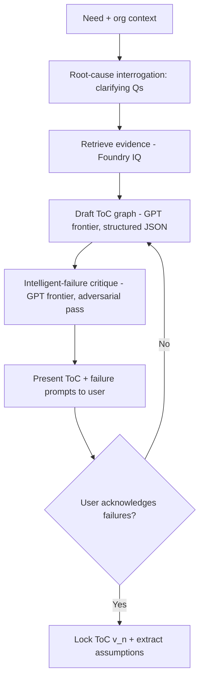

# Request for Comments (RFC) / Tech Spec

**Title:** AI Theory-of-Change Generator with "Intelligent Failure" Critique
**Date:** 2026-06-25
**Author:** Ciel Team — Create & Conquer 2026
**Status:** `Approved`
**Last reconciled:** 2026-06-25
**PRD Reference:** [prd-ciel.md](prd-ciel.md) §3 PRD-F1, US-01
**SDD Reference:** [sdd-ciel.md](sdd-ciel.md) §8 AI Architecture
**RFC ID:** `ciel-rfc-001`

---

## 1. Context & Objective

**The problem this solves:** Most social programs fail because organizations implement a preconceived solution without rigorously defining the problem ([Idea.MD.md](../Idea.MD.md)). A rigorous Theory of Change today needs expensive consultants and weeks of workshops. PRD-F1 must produce a defensible, *evidence-grounded* ToC in minutes — and actively confront the user with what has failed before, so "intelligent failure" happens in simulation, before capital is deployed.

**Reference:** implements PRD-F1 (US-01) and realizes SDD §8.

**Success criteria:**
- A plain-language need yields a structured ToC (problem → inputs → activities → outputs → outcomes → impact) with **≥1 cited evidence source per outcome** ([BRD-M1](brd-ciel.md): < 30 min).
- The user **cannot lock** a ToC without acknowledging ≥1 historical-failure prompt.
- **No ungrounded claim** is presented as fact — each is cited or labeled "unverified — needs human input."

---

## 2. Proposed Solution

A **LangGraph state machine** in the Python AI service, grounded by retrieval over the curated evidence corpus, generating a structured ToC and then critiquing it adversarially.



**Architecture changes:**
- New LangGraph graph `toc_graph` in the FastAPI service; nodes = interrogate / retrieve / draft / critique.
- `POST /api/toc/generate` (Next.js) → proxies to AI service, **streams** nodes/tokens to ToC Studio.
- On lock: extract measurable `toc_assumptions` (these become what M&E watches in RFC-002).
- New `toc_critiques` table to persist the failure prompts shown + acknowledged (auditability).

---

## 3. Technical Details & Contracts

### Data Model Changes

```sql
-- theories_of_change, toc_assumptions, evidence_sources already defined in SDD §3.
-- New:
CREATE TABLE toc_critiques (
  id          UUID PRIMARY KEY DEFAULT gen_random_uuid(),
  toc_id      UUID NOT NULL REFERENCES theories_of_change(id) ON DELETE CASCADE,
  prompt      TEXT NOT NULL,                 -- "Similar youth-jobs pilots failed when ..."
  source_ids  UUID[] DEFAULT '{}',           -- evidence_sources backing the prompt
  acknowledged BOOLEAN NOT NULL DEFAULT false,
  created_at  TIMESTAMPTZ NOT NULL DEFAULT now()
);
```

### API Changes

```
POST /api/toc/generate
Request:
{ "project_id": "uuid", "need": "string", "context": { "region": "string", "population": "string" } }

Response (text/event-stream):
event: node_started      data: {"node":"retrieve"}
event: toc_delta         data: {"path":"outcomes[0]","text":"...","source_ids":["uuid"]}
event: failure_prompt    data: {"prompt":"...","source_ids":["uuid"]}
event: run_finished      data: {"toc_id":"uuid","tokens_used":11034}

POST /api/toc/:id/lock
Request:  { "acknowledged_prompt_ids": ["uuid"] }
Response: 200 { "status":"locked","version":1,"assumptions":[{"id":"uuid","indicator":"...","threshold":12.5}] }
          409 if any unacknowledged failure prompt remains
```

### State Management
ToC Studio consumes the SSE stream and renders the graph incrementally; each node carries `source_ids` so the UI shows a provenance chip per claim. No client polling. The lock action is a Server Action that validates `failure_prompts_ack` server-side (defense in depth — never trust the client flag).

---

## 4. Alternatives Considered

| Option | Why Rejected |
|--------|-------------|
| **Custom pgvector RAG pipeline** (own chunker/embedder/retriever) instead of Foundry IQ | More control, but slower to ship and more to maintain in the hackathon window. **Decision: use Foundry IQ in V1**, keep a pgvector path as a documented escape hatch if retrieval quality is insufficient (the `evidence_sources.embedding` column already exists for this). |
| **Single-shot prompt** ("write me a ToC") | Produces plausible but ungrounded, un-critiqued output — exactly the slop that erodes trust with judges and funders. The multi-node graph is what enforces grounding + the failure critique. |
| **Skip the adversarial critique** | Removes the single most differentiated feature ("we'll tell you when to stop"); "intelligent failure" is the thesis. Kept. |
| **Free-form text ToC** (no structured graph) | Can't extract machine-watchable `toc_assumptions` for M&E (RFC-002), and can't render the visual ToC. Structured JSON required. |

---

## 5. AI / Agent Implementation Notes

**Models:** GPT (frontier) for interrogate + draft and for the one adversarial critique per ToC (a separate pass with an adversarial system prompt + lower temperature), via Microsoft Foundry (GPT-only tenant). See [cr-ciel-002.md](cr-ciel-002.md).
**Prompt strategy:** cached privileged system prefix (ToC methodology + grounding rules + output schema) + injected org/need context + retrieved chunks. Structured output validated against a JSON schema (Pydantic) before persistence.
**Tool calls:** `retrieve_evidence` (read-only), `write_toc_draft` (app-mediated draft only). No destructive tools.
**LLM edge cases:**
- Model returns a claim with no retrieved support → pipeline labels it `unverified` rather than dropping or asserting it.
- Output truncates → resume with continuation prompt keyed to the last completed graph path.
- Critique finds no relevant prior failures → still emits an explicit "no close precedent found; proceed with caution" prompt (never silently skip the gate).
**Token budget:** ~8–12k tokens/ToC (Sonnet) + ~10k for the Opus critique (rate-limited to 1/ToC). Aligns with SDD §8 budget.

---

## 6. Security, Privacy & Performance

**Security:** `/api/toc/generate` requires a valid session + org membership (RLS); `need`/`context` validated (max length, strip null bytes) before reaching the model; retrieved + user content treated as untrusted data (SDD §8.1 LLM01).
**Performance:** first token < 1.5s, full draft < 30s (streamed); critique runs async and appends. Retrieval bounded to top-k (e.g., 8) chunks.
**Privacy:** needs may describe vulnerable populations → minimize identifying detail before sending to the model; ToC content stored under org RLS; deletable per RA 10173 (CLR).

---

## 7. Execution Plan

**Feature flag:** Yes — `ENABLE_TOC_CRITIQUE` gates the Opus critique independently so the core draft path always works in a demo.

| Ticket | Description | Size |
|--------|-------------|------|
| `TOC-01` | Migration: `toc_critiques`; confirm `theories_of_change`/`toc_assumptions`/`evidence_sources` | S |
| `TOC-02` | LangGraph `toc_graph` (interrogate/retrieve/draft/critique) + Pydantic schema | L |
| `TOC-03` | Foundry IQ corpus ingestion (seed development-evidence sources, tiered) | M |
| `TOC-04` | `/api/toc/generate` SSE proxy + `/api/toc/:id/lock` Server Action (server-side ack check) | M |
| `TOC-05` | ToC Studio UI: streamed graph, provenance chips, failure-prompt gate | L |
| `TOC-06` | AI evals: groundedness, citation presence, lock-gate enforcement (QAD AI-01..04) | M |

**Rollout order:** migration → corpus ingest → graph → API → UI → evals → enable flag.
*Feeds PRD §9 milestones M2–M4.*

---

## Self-Check
- [x] §3 has exact DDL + exact request/response shapes
- [x] §4 has real rejected alternatives (Foundry IQ vs pgvector is the live decision, recorded)
- [x] §5 filled (AI is core)
- [x] §7 tickets are immediately actionable
- [x] No duplication of PRD (features) or SDD (global architecture)
